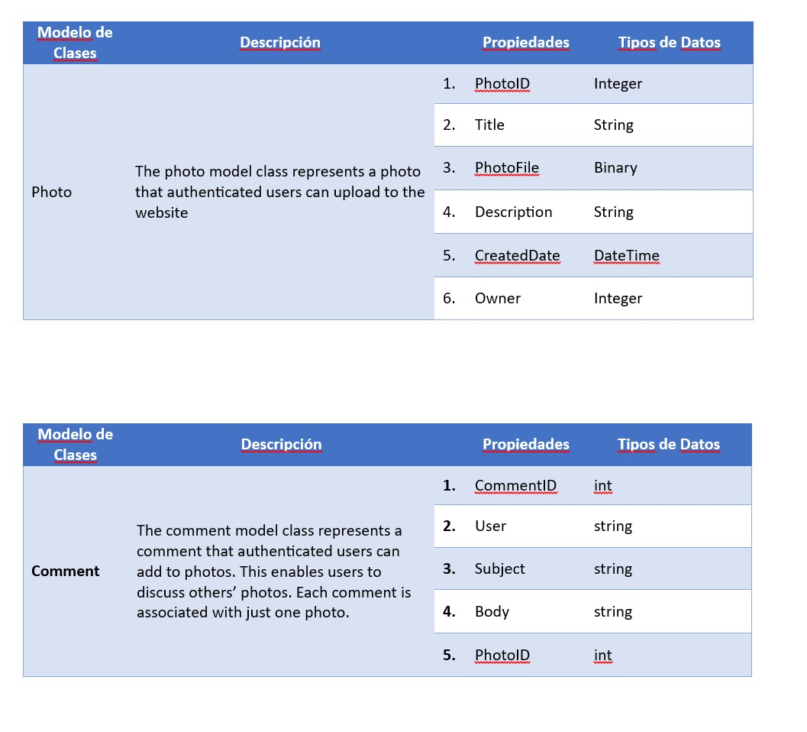
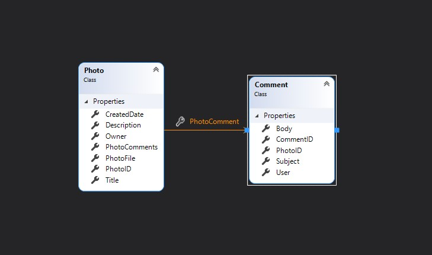
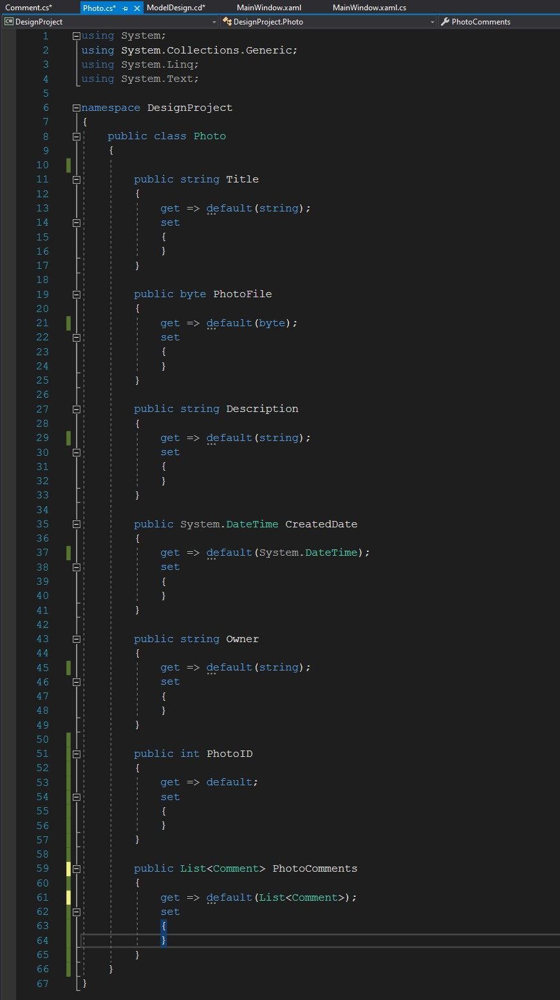
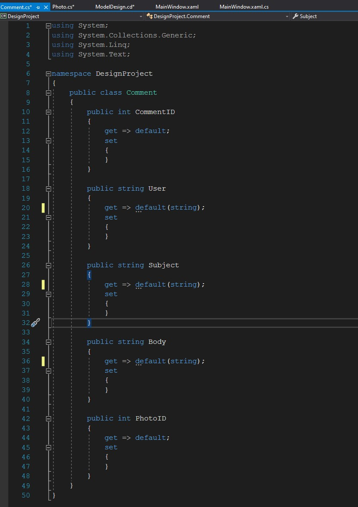

# Module 2: Designing ASP.NET Core MVC Web Applications

## Lab: Designing ASP.NET Core MVC Web Applications

1. **Nombres y apellidos:** Francisco Javier Moreno Quevedo

2. **Fecha:** 06/12/2020

3. **Resumen del Ejercicio:**  Aprender a diseñar una aplicación en ASP.NET Core MVC

4. **Dificultad o problemas presentados y como se resolvieron:** Ninguna

   

- Ejercicio 1: Planning Model Classes

  - Leemos el documento **InitialInvestigation.docx** para comprender el proyecto
  
  - Abrimos el documento **DetailedPlanningDocument.docx** y completamos la parte de MVC Model
  
  - Identificamos las clases del modelo
  
  - Añadimos las propiedades de la clase Photo y de la clase COmment en el documento
  
  - 
  
    
  
  - Creamos un proyecto en VS2019 y desde el class diagram incorporamos esas dos clases
  
  - 
  
  
  
  
  
  
  
  - 
  
    
  
  - 
